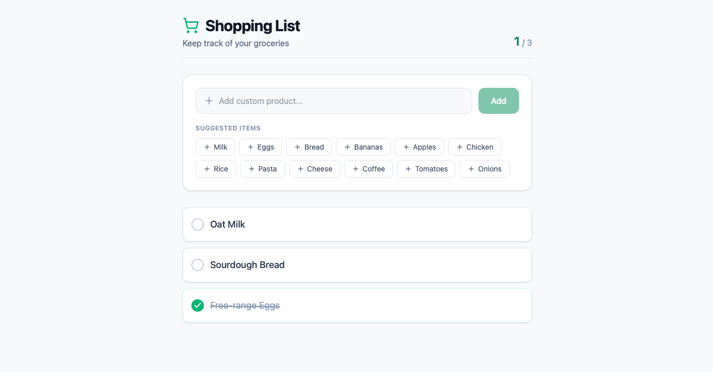

# ITMD 504 - Programming Foundations project

## Description
This is a project for ITMD 504 course.

Application is a Shopping List created from predefined products with the option to add new products.

## Stack
### Frontend
- Bootstrap
- React
- node 22

### Backend
- Symfony 8.1
- PHP 8.4

### Server and deployment
#### Frontend
- https://itmd504-frontend-g5gnfwewexbpgrcw.spaincentral-01.azurewebsites.net
#### Backend
- Health Check: https://itmd504-backend-gyagebeza5dsf0fj.spaincentral-01.azurewebsites.net/api/health

## Design / Wireframe


## Test backend endpoints

### PostMan collection
- [PostMan collection](docs/postman-collection.json)

### Products
#### Get all products
- Method: GET
- https://itmd504-backend-gyagebeza5dsf0fj.spaincentral-01.azurewebsites.net/api/products

#### Create new product
- Method: POST
- https://itmd504-backend-gyagebeza5dsf0fj.spaincentral-01.azurewebsites.net/api/products
- Body:
```json
{
  "name": "Bread",
  "price": 19.99
}
```

#### Update product
- Method: PUT
- https://itmd504-backend-gyagebeza5dsf0fj.spaincentral-01.azurewebsites.net/api/product/1
- Body:
```json
{
    "name": "Bread",
    "price": 19.99
}
```

#### Delete product
- Method: DELETE
- https://itmd504-backend-gyagebeza5dsf0fj.spaincentral-01.azurewebsites.net/api/product/1

### Shopping List Items
#### Get all shopping list items
- Method: GET
- https://itmd504-backend-gyagebeza5dsf0fj.spaincentral-01.azurewebsites.net/api/shopping-list-items

#### Create a new shopping list item
- Method: POST
- https://itmd504-backend-gyagebeza5dsf0fj.spaincentral-01.azurewebsites.net/api/add-item-by-product/{id}

#### Delete shopping list item
- Method: DELETE
- https://itmd504-backend-gyagebeza5dsf0fj.spaincentral-01.azurewebsites.net/api/delete-shopping-list-item/{id}

#### Change Shopping List Item quantity
- Method: PUT
- https://itmd504-backend-gyagebeza5dsf0fj.spaincentral-01.azurewebsites.net/api/change-item-quantity/{item-id}/{qunatity}

#### Change Shopping List Item checked status
- Method: PUT
- https://itmd504-backend-gyagebeza5dsf0fj.spaincentral-01.azurewebsites.net/api/check-item/{item-id}

## External sources
### Links
- https://getbootstrap.com/docs/5.3/getting-started/introduction/
- https://symfony.com/doc/current/setup.html
- https://react-bootstrap.netlify.app/docs/getting-started/introduction/
- https://react.dev/learn/creating-a-react-app
- https://dev.to/jic/deploying-a-php-web-app-to-azure-app-service-471c
- https://learn.microsoft.com/en-us/azure/app-service/configure-language-php?pivots=platform-linux#change-site-root

### Tools
- PhpStorm
- iTerm 2

### AI Usage
- Autocompletion in PhpStorm
- [Project structure and Azure setup](docs/01-ai-azure-setup.md)
- [Design application](docs/02-design-app.md)
- [Fixing CORS between the React frontend and Symfony API](docs/03-cors-issue.md)
